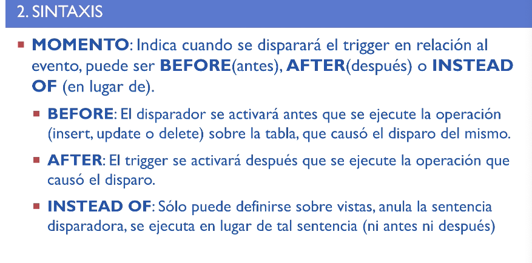
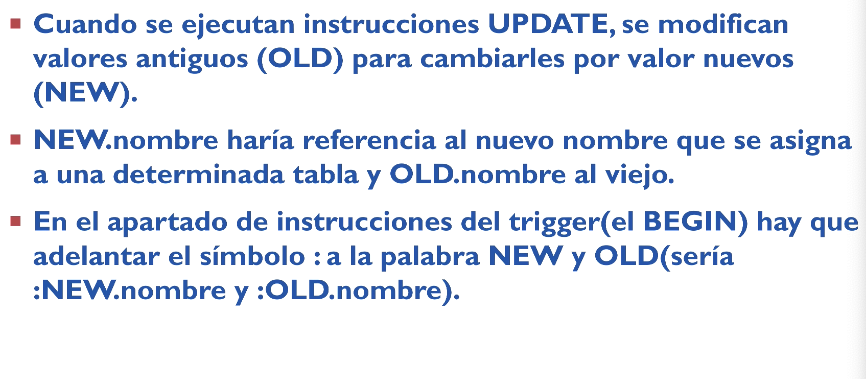

# 📚 Apuntes de PL/SQL - Tema 6

## 🎯 Objetivos
- Ampliar el lenguaje SQL con utilidades adicionales.
- Incorporar elementos de programación estructurada (bucles, condiciones, funciones) en SQL.

## 📖 Contenidos
1. [Introducción](#-1-introducción)
2. [Arquitectura](#️-2-arquitectura)
3. [Conceptos básicos](#-3-conceptos-básicos)
4. [Procedimientos]()
5. [Funciones](#-5-funciones)
6. [Control de flujo](#-6-instrucciones-de-control-de-flujo)
7. [Excepciones](#️-7-plsql-excepción)
8. [Cursores](#️-8-cursores)


---

## 🔹 1. Introducción
PL/SQL es el lenguaje procedimental de Oracle que permite:
- Usar condiciones y bucles como en lenguajes de 3ª generación (Java, C++).
- Realizar tareas administrativas, validación avanzada y consultas complejas.

**Ejemplo en otros SGBD:**
```sql
-- SQL Server usa TRANSACT SQL
-- Informix usa INFORMIX 4GL
```

---

## 🏗️ 2. Arquitectura
- **Código PL/SQL** = PL/SQL + Sentencias SQL
- **Motor PL/SQL**: Ejecuta el código PL/SQL.
- **SQL Statement Executor**: Ejecuta las sentencias SQL.

**Beneficios**:
- Modularidad 🧩
- Integración con Oracle 🔄
- Portabilidad 🧳
- Manejo de excepciones ⚠️

---

## 📝 3. Conceptos básicos

### 🔠 Estructura de un bloque PL/SQL
```sql
[DECLARE
    -- Declaraciones de variables
    v_numero NUMBER := 10;
]
BEGIN
    -- Instrucciones ejecutables
    DBMS_OUTPUT.PUT_LINE('El valor es: ' || v_numero);
[EXCEPTION
    -- Manejo de errores
    WHEN OTHERS THEN
        DBMS_OUTPUT.PUT_LINE('Error!');
]
END;
```

### 📌 Tipos de datos comunes
| Tipo | Descripción | Ejemplo |
|------|-------------|---------|
| `VARCHAR2` | Texto variable | `nombre VARCHAR2(50)` |
| `NUMBER` | Número | `precio NUMBER(8,2)` |
| `DATE` | Fecha | `fecha DATE` |
| `BOOLEAN` | Lógico | `es_valido BOOLEAN` |

### ➗ Operadores
```sql
v_total := v_precio * v_cantidad;  -- Asignación con :=
v_nombre := 'Juan' || ' Pérez';    -- Concatenación con ||
```

---

## 🛠️ 4. Procedimientos

### 🔍 **Definición y Estructura Básica**
Un procedimiento almacenado es un bloque de código PL/SQL con nombre que se guarda en la base de datos y puede ser invocado mediante una llamada.

**Estructura básica**:
```sql
CREATE [OR REPLACE] PROCEDURE nombre_procedimiento
    [(parámetro1 [IN|OUT|IN OUT] tipo_dato, ...)]
IS | AS
    -- Declaración de variables locales
BEGIN
    -- Código ejecutable
[EXCEPTION
    -- Manejo de excepciones]
END [nombre_procedimiento];
```

### 🛠️ **Tipos de Parámetros**
| Tipo | Descripción | Ejemplo |
|------|-------------|---------|
| **IN** (Por defecto) | Solo entrada | `p_id IN NUMBER` |
| **OUT** | Solo salida | `p_resultado OUT VARCHAR2` |
| **IN OUT** | Entrada y salida | `p_contador IN OUT NUMBER` |

---

**Ejecutar**:
```sql
EXEC aumentar_precio(15);  -- Aumenta un 15%
```

---

## 📊 5. Funciones
**Crear una función**:
```sql
CREATE OR REPLACE FUNCTION calcular_iva (
    p_monto IN NUMBER
) RETURN NUMBER IS
    v_iva NUMBER;
BEGIN
    v_iva := p_monto * 0.21;  -- IVA del 21%
    RETURN v_iva;
END;
/
```

**Usar en SQL**:
```sql
SELECT producto, precio, calcular_iva(precio) AS iva 
FROM productos;
```

---

## 🔄 6. Instrucciones de control de flujo

### 🔂 Bucles
**WHILE**:
```sql
DECLARE
    i NUMBER := 1;
BEGIN
    WHILE i <= 5 LOOP
        DBMS_OUTPUT.PUT_LINE('Número: ' || i);
        i := i + 1;
    END LOOP;
END;
/
```

**FOR**:
```sql
BEGIN
    FOR i IN 1..5 LOOP
        DBMS_OUTPUT.PUT_LINE('Tabla del ' || i);
        FOR j IN 1..10 LOOP
            DBMS_OUTPUT.PUT_LINE(i || ' x ' || j || ' = ' || (i*j));
        END LOOP;
    END LOOP;
END;
/
```

### ❓ Condicionales
**IF-THEN-ELSE**:
```sql
DECLARE
    v_nota NUMBER := 7;
BEGIN
    IF v_nota >= 5 THEN
        DBMS_OUTPUT.PUT_LINE('Aprobado 🎉');
    ELSE
        DBMS_OUTPUT.PUT_LINE('Suspendido 😢');
    END IF;
END;
/
```

---

## ⚠️ 7. PL/SQL Excepción

### 🚨 Excepciones predefinidas
| Excepción | Error Oracle | Descripción |
|-----------|--------------|-------------|
| `NO_DATA_FOUND` | ORA-01403 | Consulta sin resultados |
| `TOO_MANY_ROWS` | ORA-01422 | Consulta devuelve múltiples filas |
| `ZERO_DIVIDE` | ORA-01476 | División por cero |

**Ejemplo**:
```sql
DECLARE
    v_resultado NUMBER;
BEGIN
    v_resultado := 10 / 0;  -- Provoca ZERO_DIVIDE
EXCEPTION
    WHEN ZERO_DIVIDE THEN
        DBMS_OUTPUT.PUT_LINE('Error: División por cero ❌');
    WHEN OTHERS THEN
        DBMS_OUTPUT.PUT_LINE('Error inesperado: ' || SQLERRM);
END;
/
```

### 🛑 Excepciones personalizadas
```sql
DECLARE
    e_saldo_insuficiente EXCEPTION;
    v_saldo NUMBER := 100;
    v_retiro NUMBER := 200;
BEGIN
    IF v_retiro > v_saldo THEN
        RAISE e_saldo_insuficiente;
    END IF;
EXCEPTION
    WHEN e_saldo_insuficiente THEN
        DBMS_OUTPUT.PUT_LINE('Saldo insuficiente 💸');
END;
/
```


## ↪️ 8. Cursores


## 📦 9. Colecciones


## 🤝 10. Transacciones

Instrucciones básicas:

- BEGIN
- COMMIT
- EXCEPTION
- ROLLBACK
- SAVEPOINT

## 🔫 11. Disparadores

### Estructura
La estructura básica del disparador (trigger) es la siguiente:
```sql
CREATE OR REPLACE TRIGGER NOMBRE_DEL_TRIGGER
MOMENTO  /*before, after o instead of*/
EVENTO /*insert, update o delete*/
OF CAMPOS /*solo para update*/
ON NOMBRE_TABLA
NIVEL /*puede ser a nivel de sentencia(statement) o de fila (for each row)*/
WHEN CONDICION /*opcional*/
BEGIN
  -- Sentencias a ejecutar al cumplirse el evento que dispara el disparador
END nombre;
```

### ⏰ Momento
En cuanto al MOMENTO en el que se realiza la acción:


### 🆕 Referencias NEW y OLD
Sirven para referenciar al anterioro al nuevo valor despues del uptate


### 💭 Ejemplos

Ejemplo trigger que precede a un insert, le añade la fecha y lo inserta:
```sql
CREATE OR REPLACE TRIGGER tr_ingresar_libros
BEFORE INSERT ON libros
BEGIN
  INSERT INTO control VALUES(user, sysdate);
END tr_ingresar_libros;
```

Ejemplo trigger que precede a un delete, inserta quien hizo el delete y cuando en una tabla de control:
```sql
-- Crear un trigger a nivel de fila que se dispara cada vez que se ejecuta un "delete" sobre la tabla "libros",
-- se ingresa un registro en "control" con el nombre del usuario que realizó la eliminación y la fecha.

CREATE OR REPLACE TRIGGER tr_borrar_libros
BEFORE DELETE
ON libros
FOR EACH ROW
BEGIN
  INSERT INTO control VALUES(user, sysdate);
END tr_borrar_libros;
```

Ejemplo triguer que precede a varias operaciones (INSERT, UPDATE y DELETE) y hace un registro de control indicando de que operación se trata:
```sql
CREATE OR REPLACE TRIGGER tr_cambios_libros
BEFORE INSERT OR UPDATE OR DELETE -- Vigila insercion, actualización y borrado
ON libros
FOR EACH ROW
BEGIN
    IF INSERTING THEN -- Booleano que es true cuando se trata de un insert
        INSERT INTO control VALUES (user, sysdate, 'insertion');
    END IF;
END tr_cambios_libros;
```

### Ejemplos con BBDD creada en clase (archivo bbdd7deMayo.md)

un trig ins del upd que haga en la ins y el del un apunte en una tabla ctrl que tenga la operacion el user y la hora
```sql
DROP TABLE CONTROL_PIEZAS;
CREATE TABLE CONTROL_PIEZAS(
    USUARIO VARCHAR2(30),
    FECHA DATE,
    OPERACION VARCHAR2(50)
);

CREATE OR REPLACE TRIGGER TR_CONTROL_PIEZAS
BEFORE INSERT OR UPDATE OR DELETE
ON PIEZAS
BEGIN
    IF INSERTING THEN
        INSERT INTO CONTROL_PIEZAS (USUARIO,FECHA,OPERACION) VALUES(USER,SYSDATE,'INSERCION');
    END IF;
    IF UPDATING THEN
        INSERT INTO CONTROL_PIEZAS (USUARIO,FECHA,OPERACION) VALUES(USER,SYSDATE,'ACTUALIZACION');
    END IF;
    IF DELETING THEN
        INSERT INTO CONTROL_PIEZAS (USUARIO,FECHA,OPERACION) VALUES(USER,SYSDATE,'BORRADO');
    END IF;
END TR_CONTROL_PIEZAS;

INSERT INTO PIEZAS VALUES(10,'LLAVE',60,'FERRETERIA', SYSDATE);
```

Un trigger que registra en la taba audit_precio los cambios de precio:
```sql
CREATE OR REPLACE TRIGGER TR_CONTROL
AFTER INSERT OR DELETE OR UPDATE OF PRECIO ON PIEZAS
FOR EACH ROW
WHEN (NEW.PRECIO > 10) -- Antes del BEGIN NEW ú OLD se usa sin ":" al principio
BEGIN -- Dentro del BEGIN se debe poner ":" antes de NEW y de OLD
    IF DELETING THEN
        INSERT INTO CONTROL VALUES (USER, SYSDATE, 'BORRADO');
    END IF;

    IF UPDATING THEN
        INSERT INTO CONTROL VALUES (USER, SYSDATE, 'ACTUALIZADO');
        INSERT INTO PIEZAS_AUDIT VALUES(:NEW.COD_PIEZA, :OLD.PRECIO, :NEW.PRECIO, USER, SYSDATE);
    END IF;

    IF INSERTING THEN
        INSERT INTO CONTROL VALUES(USER, SYSDATE, 'INSERTADO');
    END IF;
END;
/

-- This appears to be a separate INSERT statement, not part of the trigger
INSERT INTO PIEZAS VALUES (7, 'sdasdasda', 33, 'pepe', SYSDATE);
```

## Utilidades

```sql
INSERT ALL
  INTO PRUEBA (DNI, NOMBRE) VALUES('121222222', 'ALICICICICIC')
  INTO PRUEBA (DNI, NOMBRE) VALUES('121222223', 'ALICICICICIC')
  INTO PRUEBA (DNI, NOMBRE) VALUES('121222224', 'ALICICICICIC')
SELECT * FROM DUAL;
```
---


## 📌 Resumen final
PL/SQL es un lenguaje poderoso para:
- Extender SQL con lógica procedural.
- Crear procedimientos y funciones reutilizables.
- Manejar errores de forma estructurada.
- Optimizar operaciones complejas en Oracle.

**¡Dominar PL/SQL te convertirá en un experto en bases de datos Oracle!** 🚀