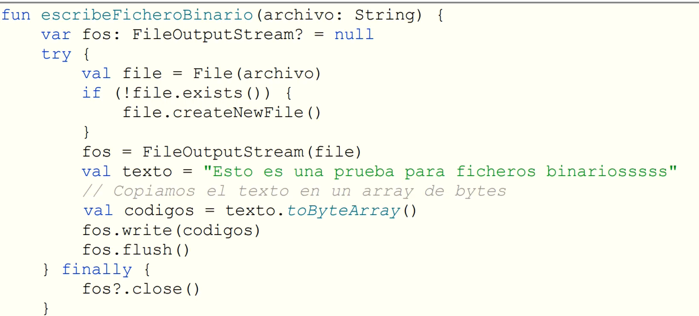

# 📝 Apuntes sobre Manejo de Ficheros en Kotlin

## 📂 Tipos de Ficheros

- **Texto plano** (.txt, .xml, .json, etc.) → Legibles con editores de texto.
- **Binarios** (.jpg, .pdf, .docx, etc.) → Contienen datos no solo de texto.

### 🔍 Acceso

- **Secuencial**: Lectura/escritura desde el inicio.
- **Aleatorio**: Acceso directo a cualquier posición.

---


# 📝 Apuntes **Kotlin** sobre Manejo de Ficheros (100% Kotlin)

## 📂 Crear/Verificar Archivos

```kotlin
import java.io.File

fun crearArchivo(ruta: String) {
    val archivo = File(ruta)

    if (!archivo.exists()) {

      // Si no existe lo crea
      createNewFile()
      println("✅ Archivo creado: $absolutePath")
    } else {
      // Si existe lo avisa
      println("⚠️ Ya existe: $name")
    }

}

// Uso:
crearArchivo("datos.txt")
```

---

## ✍️ Escribir (3 métodos Kotlin)

### 1. `writeText` (sobrescribe)

```kotlin
File("datos.txt").writeText("Contenido nuevo")
```

### 2. `appendText` (añade al final)

```kotlin
File("datos.txt").appendText("\nLínea añadida")
```

### 3. `bufferedWriter` (eficiente para grandes datos)

```kotlin
File("datos.txt").bufferedWriter().use { writer ->
  writer.write("Línea 1\n")
  writer.write("Línea 2\n")
}
```

---

## 📖 Leer (3 métodos Kotlin)

### 1. `readText` (todo el contenido)

```kotlin
val texto = File("datos.txt").readText()
println(texto)
```

### 2. `readLines` (lista de líneas)

```kotlin
File("datos.txt").readLines().forEach { println("> $it") }
```

### 3. `forEachLine` (línea por línea)

```kotlin
File("datos.txt").forEachLine { println("Línea: $it") }
```

---

## 🗑️ Borrar/Copiar

```kotlin
// Borrar
File("datos.txt").takeIf { it.exists() }?.delete()

// Copiar (Kotlin style)
File("origen.txt").copyTo(File("destino.txt"), overwrite = true)
```

---

## 🔄 Acceso Aleatorio (Kotlin + `RandomAccessFile`)

**1. Métodos**

- `file.seek(pos)`: Coloca en la posicion pasada por parametro el cursor.
- `file.read(buffer)`: Lee 

```kotlin
import java.io.RandomAccessFile

RandomAccessFile("datos.bin", "rw").use { 
  file ->
    file.seek(10)  // Posiciona el puntero
    file.writeUTF("Kotlin")  // Escribe String
    file.seek(0)
    println("Leído: ${file.readUTF()}")
}
```

## 🗂️Archivos binarios

**1. Leer archivos binarios:**
```kotlin

//Guarda toda la información de un binario (ej.: .png, .pdf, .avi) en un array
fun leeFicheroBinario(nombreArchivo: String):ByteArray? {
  var fis: FileInputStream? = null
  var listaDeBytes:ByteArray? = null
  // 

    val file = File(nombreArchivo)
    if (file.exists()) {
      fis = FileInputStream(file)
      ListaDeBytes = fis.readBytes()
      println(ListaDeBytes.size)
      println(listaDeBytes.joinToString ( separator:" "))
    } else {
      println("El fichero $nombreArchivo no existe")
    }
  } finally {
    fis?.closer()
  }

  return listaDeBytes
}
```

**2. Escribir archivos binarios:**



---

### 🔗 Recursos

- **Clase File** [(Java Docs)](https://docs.oracle.com/en/java/javase/17/docs/api/java.base/java/io/File.html)  
  -- **Referencia oficial**: [Kotlin File Handling](https://kotlinlang.org/docs/io.html)

