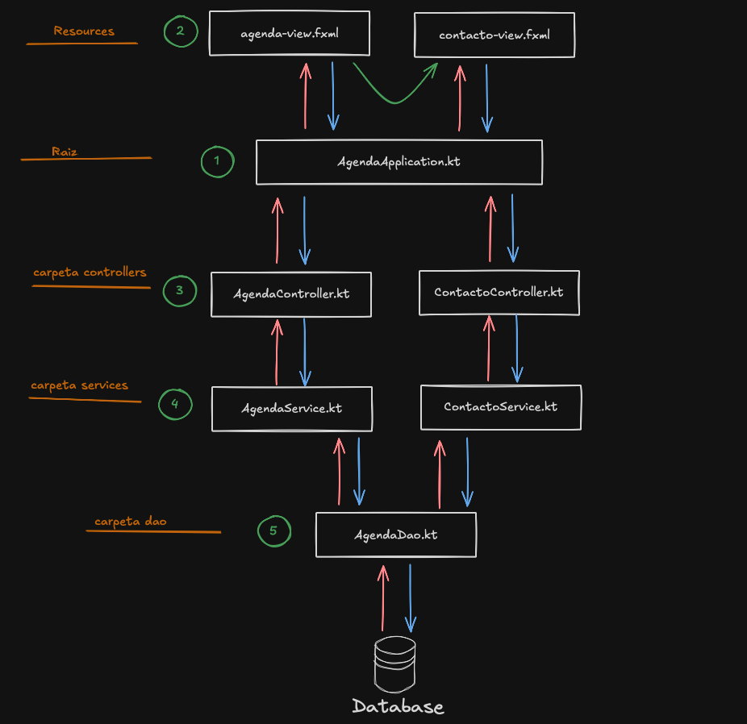
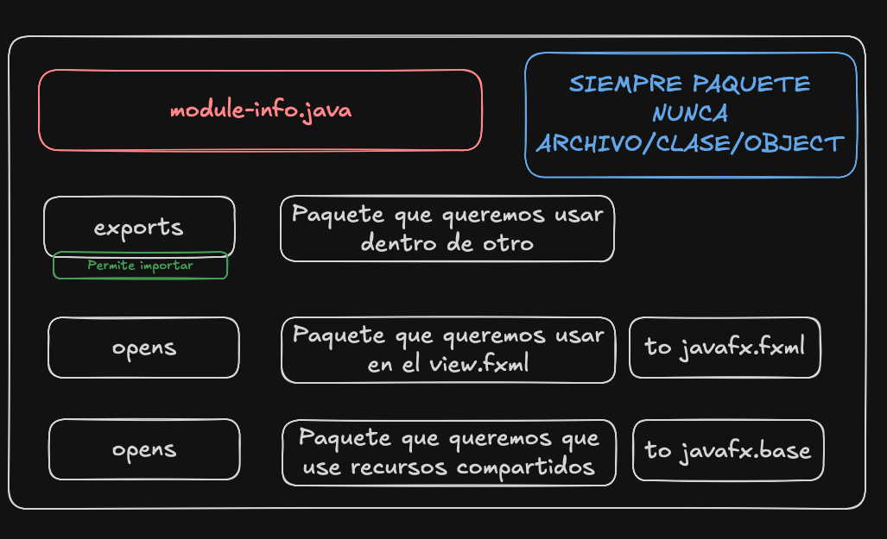
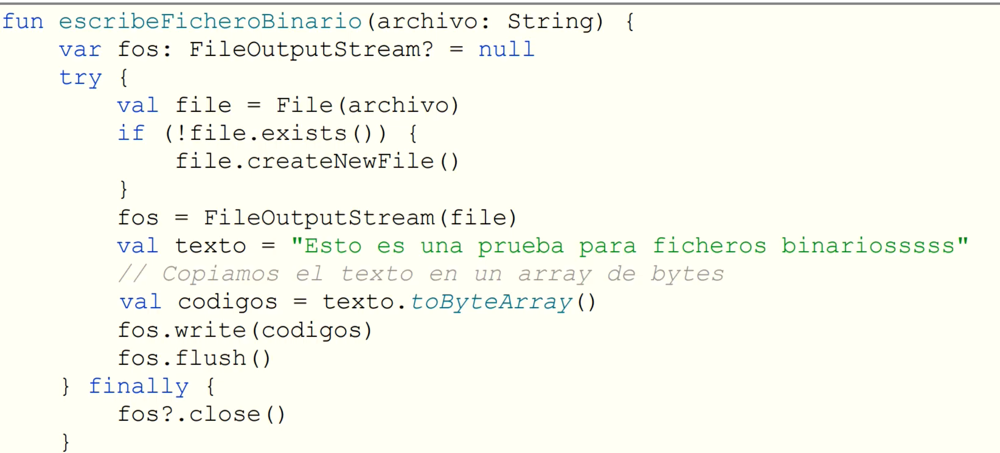
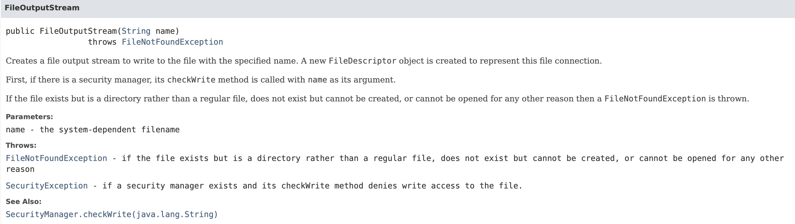

# INDICE

## kotlin + JavaFX + SQL

- [📐 Arquitectura](#arquitectura-de-los-proyectos)

- [📋 Funciones preparadas](#apuntes-examen-kotlin--sql--javafx)
  - [📦 Dependencias](#dependencias)
  - [🔌 Conexión](#conexión-básica)
  - [🔄 Abrir una view desde un controller](#abrir-otra-view-en-el-controller)
  - [🗃️ Funciones CRUD (acceso a bbdd)](#funciones-crud-en-el-dao)
    - [👀 SELECT](#1-ejecutar-consulta-select-leer)
    - [➕ INSERT](#2-ejecutar-insert)
    - [✏️ UPDATE](#3-ejecutar-update)
    - [🗑️ DELETE](#4-ejecutar-delete)
  - [⚠️ Notas Importantes](#notas-finales)

- [💻 Ejercicio practico](#ejemplo-que-hicimos-juan-y-jesus-pa-practicar)
  - [🚀 Application](#registroapplicationkt)
  - [⚙️ Service](#registroservicekt)
  - [👤 Model](#personakt-model)
  - [📝 Clase auxiliar](#datosbasicospersonakt-dto)
  - [🗄️ Dao](#registrodaokt)
  - [🎮 Primer Controller](#registrocontrollerkt)
  - [🎮 Segundo Controller](#personacontrollerkt)
  - [🖼️ view 1](#registro-viewfxml)
  - [🖼️ view 2](#persona-viewfxml)

## FICHEROS
- [📝 Apuntes sobre Manejo de Ficheros en Kotlin](#-apuntes-sobre-manejo-de-ficheros-en-kotlin)
  - [📂 Tipos de Ficheros](#-tipos-de-ficheros)
  - [🔍 Acceso](#-acceso)

- [📝 Apuntes Kotlin sobre Manejo de Ficheros](#-apuntes-kotlin-sobre-manejo-de-ficheros)
  - [🆕 Crear/Verificar Archivos](#-crearverificar-archivos)
  - [✍️ Escribir (3 métodos Kotlin)](#️-escribir-3-métodos-kotlin)
  - [📖 Leer (3 métodos Kotlin)](#-leer-3-métodos-kotlin)
  - [🗑️ Borrar/Copiar](#️-borrarcopiar)
  - [🔀 Acceso Aleatorio (Kotlin + RandomAccessFile)](#-acceso-aleatorio-kotlin--randomaccessfile)
  - [💾 Archivos binarios](#️archivos-binarios)
  - [🗂️ Directorios](#-directorios)
  - [🔗 Recursos](#-recursos)

## SERIALIZACION
- [📦 Serialización con ObjectOutputStream (OOS)](#-serialización-con-objectoutputstream-oos)
  - [¿Qué es?](#qué-es)
  - [🔧 Requisitos](#-requisitos)
  - [📝 Cómo serializar (escribir)](#-cómo-serializar-escribir)
  - [📖 Cómo deserializar (leer)](#-cómo-deserializar-leer)
  - [⚠️ Consideraciones importantes](#️-consideraciones-importantes)
  - [🔄 Ejemplo completo](#-ejemplo-completo)
  - [📌 Alternativas modernas](#-alternativas-modernas)

## CREO QUE ESTO PUEDE CAER EN EL EXAMEN
- [📝 Función para Logs Automáticos](#-función-para-logs-automáticos-kotlin)
  - [🚀 Cómo usarla](#-cómo-usarla-ejemplo)
  - [📂 Resultado en el archivo](#-resultado-en-el-archivo)
  - [🔥 Extra: Versión con try/catch simplificado](#-extra-versión-con-trycatch-simplificado-1-línea)
  - [⚠️ Importante para el examen](#️-importante-para-el-examen)

---

<br>

# Arquitectura de los proyectos





# Apuntes Examen Kotlin + SQL + JavaFX

## **Dependencias**

### Gradle (build.gradle.kts):

```kotlin
dependencies {
  implementation("mysql:mysql-connector-java:8.0.33") // Verificar versión más reciente
}
```

### Maven (pom.xml):

- Para MySQL

```xml
<dependency>
    <groupId>mysql</groupId>
    <artifactId>mysql-connector-java</artifactId>
    <version>8.0.33</version>
</dependency>
```

- Para Oracle XE

```xml
<dependency>
    <groupId>com.oracle.database.jdbc</groupId>
    <artifactId>ojdbc8</artifactId>
    <version>12.2.0.1</version>
</dependency>

```

---

## **Conexión Básica**

- Para MySQL

```kotlin
import java.sql.DriverManager
import java.sql.Connection

fun getConnection(): Connection {
    val dbName = "nombreDB"
    val url = "jdbc:mysql://localhost:3306/${dbName}"
    val user = "root" // Para MySQL
    val password = "" // Vacío por defecto para MySQL

    return DriverManager.getConnection(url, user, password)
}
```

- Para Oracle XE

```kotlin
val connection = DriverManager.getConnection(
  "jdbc:oracle:thin:@localhost:1521:XE" ,
  "USUARIO",
  "CONTRASEÑA"
)
```

---

## **Abrir otra view (En el controller)**

## **Funciones CRUD (En el DAO)**

### 1. Ejecutar Consulta SELECT (Leer)

#### Get por un parametro (Traer un contacto pasando su id)

```kotlin
// Funcion para traer un objeto por id
fun getContactoById(id: Int): Contacto? {
    // Inicializa todo fuera
    var connection: Connection? = null
    var preparedStatement: PreparedStatement? = null
    var resultSet: ResultSet? = null

    return try {
      connection = getConnection()

      // Query que se va a ejecutar CAMBIAR
      val query = "SELECT id, nombre, apellidos, telefono, direccion, fecha_nacimiento FROM agenda WHERE id = ?"
      preparedStatement = connection.prepareStatement(query)

      // Parámetro que se pondrá en la ?
      preparedStatement.setInt(1, id)
      // Se hace la query y se guarda en la bbdd
      resultSet = preparedStatement.executeQuery()

      // Si encuentra la fila crea un objeto Contacto con los datos de la bbdd
      if (resultSet.next()) {
        Contacto(
          // parametroKotlin = resultSet.getTipo("parametro_SQL") CAMBIAR en TODAS
          id = resultSet.getInt("id"),
          nombre = resultSet.getString("name"),
          apellidos = resultSet.getString("description"),
          telefono = resultSet.getInt("telefono"),
          direccion = resultSet.getString("direccion"),
          fechaNacimiento = resultSet.getString("fecha_nacimiento").toString()
        )
      // Si no la encuentra escupe null
      } else {
        null
      }
    } catch (e: Exception) {
      e.printStackTrace()
      null
    } finally {
      resultSet?.close()
      preparedStatement?.close()
      connection?.close()
    }
  }
```

#### Sin parámetro (Traer todos los contactos)

```kotlin
// Funcion que recupera todos los objetos de la tabla y los devuelve en un array
fun getContactos(): ArrayList<Contacto> {
    // Inicializa todo fuera
    val contactos = ArrayList<Contacto>()
    var connection: Connection? = null
    var statement: Statement? = null
    var resultSet: ResultSet? = null

    try {
      connection = getConnection()
      val query = "SELECT id, nombre, apellidos, telefono, direccion, fecha_nacimiento FROM contacto"
      statement = connection.createStatement()
      resultSet = statement.executeQuery(query)

      while (resultSet.next()) {
        contactos.add(
          Contacto(
            id = resultSet.getInt("id"),
            nombre = resultSet.getString("nombre"),
            apellidos = resultSet.getString("apellidos"),
            telefono = resultSet.getInt("telefono"),
            direccion = resultSet.getString("direccion"),
            fechaNacimiento = resultSet.getString("fecha_nacimiento").toString()
          )
        )
      }
    } catch (e: Exception) {
      e.printStackTrace()
    } finally {
      resultSet?.close()
      statement?.close()
      connection?.close()
    }

    return contactos
  }
```

### 2. Ejecutar INSERT

```kotlin
// INSERT - Retorna el Contacto con el ID generado
  fun insertContacto(contacto: Contacto): Contacto? {
    var connection: Connection? = null
    var preparedStatement: PreparedStatement? = null
    var generatedKeys: ResultSet? = null

    return try {
      connection = getConnection()
      val query = """
            INSERT INTO contacto
            (nombre, apellidos, telefono, direccion, fecha_nacimiento)
            VALUES (?, ?, ?, ?, ?)
        """.trimIndent()

      // Indicamos que queremos recuperar las claves generadas
      preparedStatement = connection.prepareStatement(query, Statement.RETURN_GENERATED_KEYS)

      preparedStatement.apply {
        setString(1, contacto.nombre)
        setString(2, contacto.apellidos)
        setInt(3, contacto.telefono)
        setString(4, contacto.direccion)
        setString(5, contacto.fechaNacimiento)
      }.executeUpdate()

      // Obtenemos el ID generado
      generatedKeys = preparedStatement.generatedKeys
      if (generatedKeys.next()) {
        val newId = generatedKeys.getInt(1)
        contacto.copy(id = newId)
      } else {
        null
      }
    } catch (e: Exception) {
      e.printStackTrace()
      null
    } finally {
      generatedKeys?.close()
      preparedStatement?.close()
      connection?.close()
    }
  }
```

### 3. Ejecutar UPDATE

```kotlin
// UPDATE - Retorna el número de filas afectadas
  fun updateContacto(contacto: Contacto): Int {
    var connection: Connection? = null
    var preparedStatement: PreparedStatement? = null

    return try {
      // Creamos la conexión
      connection = getConnection()

      // Creamos la query
      val query = """
            UPDATE contacto SET
            nombre = ?,
            apellidos = ?,
            telefono = ?,
            direccion = ?,
            fecha_nacimiento = ?
            WHERE id = ?
        """.trimIndent()

      // Creamos el prepared statement del update con los parámetros ?
      preparedStatement = connection.prepareStatement(query).apply {
        // Cambiar según model
        setString(1, contacto.nombre)
        setString(2, contacto.apellidos)
        setInt(3, contacto.telefono)
        setString(4, contacto.direccion)
        setString(5, contacto.fechaNacimiento)
        setInt(6, contacto.id)
      }

      // Ejecutamos la query
      preparedStatement.executeUpdate()
    } catch (e: Exception) {
      e.printStackTrace()
      // Si hay excepción retornamos 0 filas afectadas
      0
    } finally {
      preparedStatement?.close()
      connection?.close()
    }
  }
```

### 4. Ejecutar DELETE

```kotlin
// DELETE - Retorna el número de filas afectadas
fun deleteContacto(id: Int): Int {
  // Inicializamos variables
  var connection: Connection? = null
  var preparedStatement: PreparedStatement? = null

  return try {
    // Creamos la conexión
    connection = getConnection()

    // Creamos la query del delete
    val query = "DELETE FROM contacto WHERE id = ?"

    // Creamos el prepared statement del delete
    preparedStatement = connection.prepareStatement(query).apply {
      setInt(1, id)
    }

    // Ejecutamos el delete
    preparedStatement.executeUpdate()
  } catch (e: Exception) {
    e.printStackTrace()
    // Si hay excepción retornamos 0 filas afectadas
    0
  } finally {
    preparedStatement?.close()
    connection?.close()
  }
}
```

---

## **Ejemplos de Uso (en el SERVICE)**

### Consulta SELECT:

```kotlin
val contactos: ArrayList<contactos> = ContactoDao.getContactos()
```

### INSERT:

```kotlin
val nuevoContacto: Int = ContactoDao.addContacto()
```

### UPDATE:

```kotlin
val filasAfectadas: Int = ContactoDao.updateContacto()
```

### DELETE:

```kotlin
executeUpdate("DELETE FROM usuarios WHERE id = :id", mapOf("id" to 5))
```

---

## **Notas Finales**

- Usar `?` en lugar de `:nombre` para parámetros posicionales

# Ejemplo que hicimos juan y jesus pa practicar

## RegistroApplication.kt

```kotlin
package juan.dia0

import javafx.application.Application
import javafx.fxml.FXMLLoader
import javafx.scene.Scene
import javafx.stage.Stage
import juan.dia0.dao.RegistroDao

class RegistroApplication : Application() {
    override fun start(stage: Stage) {
        val fxmlLoader = FXMLLoader(RegistroApplication::class.java.getResource("registro-view.fxml"))
        val scene = Scene(fxmlLoader.load())
        stage.title = "Hello!"
        stage.scene = scene
        stage.show()
    }
}


fun main() {

    Application.launch(RegistroApplication::class.java)

}
```

## RegistroService.kt

```kotlin
package juan.dia0.services

import juan.dia0.dao.RegistroDao
import juan.dia0.dao.RegistroDao.getPersonas
import juan.dia0.dto.DatosBasicosPersona
import juan.dia0.model.Persona

object RegistroService {

    fun getPersonaById(id: Int): Persona? {
        return RegistroDao.getPersonaByID(id)
    }

    // Creamos la funcion para obtener los datos basicos de las personas
    fun getDatosPersonas(): ArrayList<DatosBasicosPersona> {

        // obtenemos las personas desde el dao
        val personas = getPersonas()

        // creamos una variable para guardar los datos basicos
        val datosBasicosPersonas = ArrayList<DatosBasicosPersona>()

        // recorremos las personas y guardamos los datos basicos
        personas.forEach { persona: Persona ->

            // extraemos los datos basicos de la persona y los guardamos en la variable
                // Aqui estan solo puestos los que yo quiero que se vean
            datosBasicosPersonas.add(DatosBasicosPersona(persona.id_persona, persona.dni, persona.nombre))
        }

        // retornamos los datos basicos
        return datosBasicosPersonas
    }

    // Creamos la funcion para insertar a las personas en la BBDD
    fun savePersona(persona: Persona): Persona? {
        // Comprobamos si la persona es valida
        val isValido = validatePersona(persona)
        println(isValido)
        // Si es valida la mandamos a la BBDD
        if(isValido){
            return RegistroDao.insertPersona(persona)
        } else {
            // sino retornamos un nulo
            return null
        }

    }

    // Validacion de una persona
    private fun validatePersona(item:Persona): Boolean {
        // creamos una variable booleana para guardar si hay algun error
        var isError = false

        // Comprobamos las opciones posibles de que haya un error en la persona
            // (estos son los atributos de mi ejemplo)
        if (item.id_persona.toString().length !in 1..3) isError = true
        if (item.nombre.length !in 1..100) isError = true
        if (item.dni.length !in 1..20) isError = true
        if (item.edad.toString().length !in 1..3) isError = true
        if (item.cargo.length !in 1..50) isError = true

        // Retornamos si hay un error o no
        return !isError

    }

    fun deletePersonaPorId(id: Int): Int {
        return RegistroDao.deletePersonaPorId(id)
    }

    fun updatePersona(persona: Persona): Int {
        return RegistroDao.updatePersona(persona)
    }


}
```

## Persona.kt (model)

## DatosBasicosPersona.kt (dto)

```kotlin
package juan.dia0.dto

data class DatosBasicosPersona(
  val id_persona: Int,
  val dni: String,
  val nombre: String
)

```

## RegistroDao.kt

```kotlin
package juan.dia0.dao

import juan.dia0.model.Persona
import java.sql.*

object RegistroDao {
    // Función para obtener una conexión a la base de datos
    private fun getConnection(): Connection {
        val connection = DriverManager.getConnection(
            "jdbc:oracle:thin:@localhost:1521:XE" ,
            "PROGRAMIN",
            "PROGRAMIN"
        )
        return connection
    }

    // Función para obtener una persona por su DNI
    fun getPersonaByDni(dni: String): Persona? {
        var connection: Connection? = null
        var preparedStatement: PreparedStatement? = null
        var resultSet: ResultSet? = null

        return try {
            connection = getConnection()
            val query = "SELECT id_persona, dni, nombre, cargo, is_soltero, is_casado, edad FROM PERSONA_HUMANA WHERE id_persona = ?"
            preparedStatement = connection.prepareStatement(query)
            preparedStatement.setString(1, dni)
            resultSet = preparedStatement.executeQuery()

            if (resultSet.next()) {
                Persona(
                    id_persona = resultSet.getInt("id_persona"),
                    dni = resultSet.getString("dni"),
                    nombre = resultSet.getString("nombre"),
                    cargo = resultSet.getString("cargo"),
                    edad = resultSet.getInt("edad"),
                    isSoltero = resultSet.getBoolean("is_soltero"),
                    isCasado = resultSet.getBoolean("is_casado")
                )
            } else {
                null
            }
        } catch (e: Exception) {
            e.printStackTrace()
            null
        } finally {
            resultSet?.close()
            preparedStatement?.close()
            connection?.close()
        }
    }
    // Función para obtener una persona por su ID
    fun getPersonaByID(id_persona: Int): Persona? {
        var connection: Connection? = null
        var preparedStatement: PreparedStatement? = null
        var resultSet: ResultSet? = null

        return try {
            connection = getConnection()
            val query = "SELECT id_persona, dni, nombre, cargo, is_soltero, is_casado, edad FROM PERSONA_HUMANA WHERE id_persona = ?"
            preparedStatement = connection.prepareStatement(query)
            preparedStatement.setInt(1, id_persona)
            resultSet = preparedStatement.executeQuery()

            if (resultSet.next()) {
                Persona(
                    id_persona = resultSet.getInt("id_persona"),
                    dni = resultSet.getString("dni"),
                    nombre = resultSet.getString("nombre"),
                    cargo = resultSet.getString("cargo"),
                    edad = resultSet.getInt("edad"),
                    isSoltero = resultSet.getBoolean("is_soltero"),
                    isCasado = resultSet.getBoolean("is_casado")
                )
            } else {
                null
            }
        } catch (e: Exception) {
            e.printStackTrace()
            null
        } finally {
            resultSet?.close()
            preparedStatement?.close()
            connection?.close()
        }
    }
    fun getPersonas(): ArrayList<Persona> {
        val personas = ArrayList<Persona>()
        var connection: Connection? = null
        var statement: Statement? = null
        var resultSet: ResultSet? = null

        try {
            connection = getConnection()
            val query = "SELECT id_persona, dni, nombre, cargo, is_soltero, is_casado, edad FROM PERSONA_HUMANA"
            statement = connection.createStatement()
            resultSet = statement.executeQuery(query)

            while (resultSet.next()) {
                personas.add(
                    Persona(
                        id_persona = resultSet.getInt("id_persona"),
                        dni = resultSet.getString("dni"),
                        nombre = resultSet.getString("nombre"),
                        cargo = resultSet.getString("cargo"),
                        edad = resultSet.getInt("edad"),
                        isSoltero = resultSet.getBoolean("is_soltero"),
                        isCasado = resultSet.getBoolean("is_casado")
                    )
                )
            }
        } catch (e: Exception) {
            e.printStackTrace()
        } finally {
            resultSet?.close()
            statement?.close()
            connection?.close()
        }

        return personas
    }
    // INSERT - Retorna la Persona con el ID generado
    fun insertPersona(persona: Persona): Persona? {
        var connection: Connection? = null
        var preparedStatement: PreparedStatement? = null
        var generatedKeys: ResultSet? = null

        return try {
            connection = getConnection()
            val query = """
            INSERT INTO PERSONA_HUMANA
            (dni, nombre, cargo, is_soltero, is_casado, edad)
            VALUES (?, ?, ?, ?, ?, ?)
        """.trimIndent()

            preparedStatement = connection.prepareStatement(query, arrayOf("id_persona"))

            preparedStatement.apply {
                setString(1, persona.dni)
                setString(2, persona.nombre)
                setString(3, persona.cargo)
                setInt(4, if (persona.isSoltero) 1 else 0)
                setInt(5, if (persona.isCasado) 1 else 0)
                setInt(6, persona.edad)
            }.executeUpdate()

            generatedKeys = preparedStatement.generatedKeys
            if (generatedKeys.next()) {
                val newId = generatedKeys.getInt(1)
                persona.copy(id_persona = newId)
            } else {
                println("No se pudo obtener el ID generado")
                null
            }
        } catch (e: SQLException) {
            println("Error SQL al insertar persona: ${e.message}")
            e.printStackTrace()
            null
        } catch (e: Exception) {
            println("Error general al insertar persona: ${e.message}")
            e.printStackTrace()
            null
        } finally {
            generatedKeys?.close()
            preparedStatement?.close()
            connection?.close()
        }
    }
    // UPDATE - Retorna el número de filas afectadas
    fun updatePersona(persona: Persona): Int {
        var connection: Connection? = null
        var preparedStatement: PreparedStatement? = null

        return try {
            connection = getConnection()
            val query = """
            UPDATE PERSONA_HUMANA SET
            dni = ?,
            nombre = ?,
            cargo = ?,
            is_soltero = ?,
            is_casado = ?,
            edad = ?
            WHERE id_persona = ?
        """.trimIndent()

            preparedStatement = connection.prepareStatement(query).apply {
                setString(1, persona.dni)
                setString(2, persona.nombre)
                setString(3, persona.cargo)
                setInt(4, if (persona.isSoltero) 1 else 0)
                setInt(5, if (persona.isCasado) 1 else 0)
                setInt(6, persona.edad)
                setInt(7, persona.id_persona)
            }

            preparedStatement.executeUpdate()
        } catch (e: Exception) {
            e.printStackTrace()
            0
        } finally {
            preparedStatement?.close()
            connection?.close()
        }
    }

    // DELETE - Retorna el número de filas afectadas
    fun deletePersonaPorId(id: Int): Int {
        var connection: Connection? = null
        var preparedStatement: PreparedStatement? = null

        return try {
            connection = getConnection()
            val query = "DELETE FROM PERSONA_HUMANA WHERE id_persona = ?"

            preparedStatement = connection.prepareStatement(query).apply {
                setInt(1, id)
            }

            preparedStatement.executeUpdate()
        } catch (e: Exception) {
            e.printStackTrace()
            0
        } finally {
            preparedStatement?.close()
            connection?.close()
        }
    }
}
```

## RegistroController.kt

```kotlin
package juan.dia0.controllers

import javafx.collections.FXCollections
import javafx.collections.ObservableList
import javafx.event.ActionEvent
import javafx.fxml.FXML
import javafx.fxml.FXMLLoader
import javafx.fxml.Initializable
import javafx.scene.Scene
import javafx.scene.control.*
import javafx.stage.Stage
import juan.dia0.RegistroApplication
import juan.dia0.dto.DatosBasicosPersona
import juan.dia0.model.Persona
import juan.dia0.services.RegistroService

import java.net.URL
import java.util.*

class RegistroController: Initializable {

    override fun initialize(p0: URL?, p1: ResourceBundle?) {
        edad.valueFactory = SpinnerValueFactory.IntegerSpinnerValueFactory(0, 100)
        cargo.items.addAll(
            "Gerente",
            "Analista",
            "Desarrollador",
            "Diseñadora",
            "Contador"
        )

        personasTable.items = personasData
        cargarPersonas()
    }

    @FXML
    private lateinit var addPersonaButton: Button

    @FXML
    private lateinit var cargo: ChoiceBox<String>

    @FXML
    private lateinit var deletePersona: Button

    @FXML
    private lateinit var dni: TextField

    @FXML
    private lateinit var edad: Spinner<Int>

    @FXML
    private lateinit var isCasado: CheckBox

    @FXML
    private lateinit var isSoltero: CheckBox

    @FXML
    private lateinit var personasTable: TableView<DatosBasicosPersona>

    private val personasData: ObservableList<DatosBasicosPersona> = FXCollections.observableArrayList()
    fun cargarPersonas(){
        try {
            personasData.clear()
            val personas = RegistroService.getDatosPersonas()
            personasData.addAll(personas)

        }catch (e: Exception){
            e.printStackTrace()
        }
    }

    @FXML
    private lateinit var nombre: TextField

    @FXML
    private lateinit var showDni: Button

    @FXML
    fun addPersona(event: ActionEvent) {
        val persona = Persona(-1, dni.text, nombre.text,cargo.value,isSoltero.isSelected, isCasado.isSelected,edad.value)
        RegistroService.savePersona(persona)
        cargarPersonas()
    }

    @FXML
    fun deletePersona(event: ActionEvent) {
        val persona = personasTable.selectionModel.selectedItem
        if(persona != null) {
            RegistroService.deletePersonaPorId(persona.id_persona)
            cargarPersonas()
        }
    }

    @FXML
    fun showPersona(event: ActionEvent) {
        val datosPersona = personasTable.selectionModel.selectedItem

        if(datosPersona != null){
            val persona = RegistroService.getPersonaById(datosPersona.id_persona)


            if (persona != null) {
                val loader = FXMLLoader(RegistroApplication::class.java.getResource("persona-view.fxml"))
                val scene = Scene(loader.load())
                val stage = Stage()
                val personaController = loader.getController<PersonaController>()
                personaController.setDatos(persona)
                stage.title = "Hello!"
                stage.scene = scene
                stage.show()
            }
            else{
                println("no estas pasando nada")
            }


        }
    }


}

```

## PersonaController.kt

```kotlin
package juan.dia0.controllers

import javafx.event.ActionEvent
import javafx.fxml.FXML
import javafx.fxml.Initializable
import javafx.scene.control.*
import javafx.stage.Stage
import juan.dia0.model.Persona
import juan.dia0.services.RegistroService
import java.net.URL
import java.util.*
import kotlin.system.exitProcess

class PersonaController : Initializable{

    override fun initialize(p0: URL?, p1: ResourceBundle?) {
        edad.valueFactory = SpinnerValueFactory.IntegerSpinnerValueFactory(0, 100)
        cargo.items.addAll(
            "Gerente",
            "Analista",
            "Desarrollador",
            "Diseñadora",
            "Contador"
        )

    }

    @FXML
    private lateinit var cargo: ChoiceBox<String>

    @FXML
    private lateinit var dni: TextField

    @FXML
    private lateinit var edad: Spinner<Int>

    @FXML
    private lateinit var guardar: Button

    @FXML
    private lateinit var isCasado: RadioButton

    @FXML
    private lateinit var isSoltero: RadioButton

    @FXML
    private lateinit var nombre: TextField

    @FXML
    private lateinit var volver: Button

    @FXML
    fun close(event: ActionEvent) {
        cerrarVentana()
    }

    @FXML
    fun save(event: ActionEvent) {
        val personaAct = Persona(
            persona.id_persona,
            dni.text,
            nombre.text,
            cargo.value.toString(),
            isSoltero.isSelected,
            isCasado.isSelected,
            edad.value.toInt()
        )

        var pilila = RegistroService.updatePersona(personaAct)

        val alert = Alert(Alert.AlertType.INFORMATION)
        if (pilila > 0) {
            alert.title = "Información"
            alert.headerText = "Operación completada"
            alert.contentText = "El usuario se ha guardado correctamente."
            alert.showAndWait()
        }
        else
        {
            alert.title = "Problemas"
            alert.headerText = "Operación incompleta"
            alert.contentText = "El usuario no se ha guardado."
            alert.showAndWait()
        }
    }

    lateinit var persona : Persona

    fun setDatos (persona: Persona){
        this.persona = persona
        dni.text = persona.dni
        nombre.text = persona.nombre
        cargo.value = persona.cargo
        edad.valueFactory.value = persona.edad
        isSoltero.isSelected = persona.isSoltero
        isCasado.isSelected = persona.isCasado
    }

    fun cerrarVentana() {
        val stage = volver.scene.window as javafx.stage.Stage
        stage.close()
    }
}
```

## registro-view.fxml

```xml
<?xml version="1.0" encoding="UTF-8"?>

<?import javafx.scene.control.Button?>
<?import javafx.scene.control.CheckBox?>
<?import javafx.scene.control.ChoiceBox?>
<?import javafx.scene.control.Label?>
<?import javafx.scene.control.Spinner?>
<?import javafx.scene.control.TableColumn?>
<?import javafx.scene.control.TableView?>
<?import javafx.scene.control.TextField?>
<?import javafx.scene.control.cell.PropertyValueFactory?>
<?import javafx.scene.layout.AnchorPane?>

<AnchorPane maxHeight="-Infinity" maxWidth="-Infinity" minHeight="-Infinity" minWidth="-Infinity" prefHeight="400.0" prefWidth="600.0" xmlns="http://javafx.com/javafx/23.0.1" xmlns:fx="http://javafx.com/fxml/1" fx:controller="juan.dia0.controllers.RegistroController">
   <children>
      <CheckBox fx:id="isSoltero" layoutX="95.0" layoutY="176.0" mnemonicParsing="false" text="Soltero" />
      <CheckBox fx:id="isCasado" layoutX="96.0" layoutY="200.0" mnemonicParsing="false" text="Casado" />
      <Label layoutX="40.0" layoutY="66.0" text="DNI" />
      <Label layoutX="40.0" layoutY="100.0" text="Nombre" />
      <TextField fx:id="dni" layoutX="89.0" layoutY="62.0" />
      <TextField fx:id="nombre" layoutX="90.0" layoutY="96.0" />
      <ChoiceBox fx:id="cargo" layoutX="89.0" layoutY="305.0" prefHeight="26.0" prefWidth="74.0" />
      <Button fx:id="showDniButton" layoutX="256.0" layoutY="306.0" mnemonicParsing="false" onAction="#showPersona" prefHeight="26.0" prefWidth="138.0" text="Ver DNI seleccionado" />
      <Button fx:id="deletePersonaButton" layoutX="408.0" layoutY="306.0" mnemonicParsing="false" onAction="#deletePersona" prefHeight="26.0" prefWidth="106.0" text="Borrar Persona" />
      <Label layoutX="40.0" layoutY="310.0" text="Cargo" />
      <Button fx:id="addPersonaButton" layoutX="98.0" layoutY="349.0" mnemonicParsing="false" onAction="#addPersona" prefHeight="18.0" prefWidth="56.0" text="Añadir" />
      <Label layoutX="54.0" layoutY="158.0" text="Estado Civil" />
      <Spinner fx:id="edad" layoutX="95.0" layoutY="249.0" prefHeight="26.0" prefWidth="60.0" />
      <Label layoutX="40.0" layoutY="253.0" text="Edad" />
      <TableView fx:id="personasTable" layoutX="308.0" layoutY="35.0" prefHeight="219.0" prefWidth="270.0">
        <columns>
            <TableColumn prefWidth="48.79998779296875" text="ID">
                <cellValueFactory>
                    <PropertyValueFactory property="id_persona" />
                </cellValueFactory>
            </TableColumn>
          <TableColumn prefWidth="101.60003662109375" text="DNI">
              <cellValueFactory>
                  <PropertyValueFactory property="dni" />
              </cellValueFactory>
          </TableColumn>
            <TableColumn prefWidth="118.39999999999998" text="NOMBRE">
                <cellValueFactory>
                    <PropertyValueFactory property="nombre" />
                </cellValueFactory>
            </TableColumn>
        </columns>
      </TableView>
   </children>
</AnchorPane>
```

## persona-view.fxml

```xml
<?xml version="1.0" encoding="UTF-8"?>

<?import javafx.scene.control.Button?>
<?import javafx.scene.control.ChoiceBox?>
<?import javafx.scene.control.Label?>
<?import javafx.scene.control.RadioButton?>
<?import javafx.scene.control.Spinner?>
<?import javafx.scene.control.TextField?>
<?import javafx.scene.layout.AnchorPane?>

<AnchorPane prefHeight="503.0" prefWidth="328.0" xmlns="http://javafx.com/javafx/23.0.1" xmlns:fx="http://javafx.com/fxml/1" fx:controller="juan.dia0.PersonaView">
   <children>
      <TextField fx:id="dni" layoutX="64.0" layoutY="45.0" />
      <Label layoutX="21.0" layoutY="49.0" text="DNI" />
      <Label layoutX="10.0" layoutY="107.0" text="Nombre" />
      <Label layoutX="21.0" layoutY="172.0" text="Estado Civil" />
      <Label layoutX="21.0" layoutY="311.0" text="Cargo" />
      <Label layoutX="22.0" layoutY="274.0" text="Edad" />
      <TextField fx:id="nombre" layoutX="64.0" layoutY="103.0" />
      <RadioButton fx:id="isSoltero" layoutX="71.0" layoutY="200.0" mnemonicParsing="false" prefHeight="17.0" prefWidth="101.0" text="Soltero" />
      <RadioButton fx:id="isCasado" layoutX="71.0" layoutY="235.0" mnemonicParsing="false" text="Casado" />
      <Spinner fx:id="edad" layoutX="78.0" layoutY="270.0" prefHeight="25.0" prefWidth="87.0" />
      <ChoiceBox fx:id="cargo" layoutX="78.0" layoutY="307.0" prefWidth="150.0" />
      <Button fx:id="guardar" layoutX="69.0" layoutY="404.0" mnemonicParsing="false" onAction="#save" text="Guardar" />
      <Button fx:id="volver" layoutX="182.0" layoutY="404.0" mnemonicParsing="false" onAction="#close" text="Volver" />
   </children>
</AnchorPane>
```

# 📝 Apuntes sobre Manejo de Ficheros en Kotlin

## 📂 Tipos de Ficheros

- **Texto plano** (.txt, .xml, .json, etc.) → Legibles con editores de texto.
- **Binarios** (.jpg, .pdf, .docx, etc.) → Contienen datos no solo de texto.

### 🔍 Acceso

- **Secuencial**: Lectura/escritura desde el inicio.
- **Aleatorio**: Acceso directo a cualquier posición.

---

# 📝 Apuntes **Kotlin** sobre Manejo de Ficheros

## 📂 Crear/Verificar Archivos

### Crear archivo vacío

```kotlin
import java.io.File

fun crearArchivo(ruta: String) {
    val file = File(ruta)

    if (!file.exists()) {

      // Si no existe lo crea
      file.createNewFile()
      println("✅ Archivo creado: ${file.absolutePath}")
    } else {
      // Si existe lo avisa
      println("⚠️ Ya existe: ${file.name}")
    }

}

// Uso:
crearArchivo("datos.txt")
```

### Crear archivo con contenido (con FileWriter)

```Kotlin
fun createFileOf(pathName: String, content: String): File {
  // Convertimos a Path
  val path = Path(pathName)
  // Obtenemos el directorio padre si no es un directorio
  val parentPath = if (!path.isDirectory()) path.parent else path

  // Instanciamos el archivo
  val file = File(parentPath.toString(), "fichero.txt")

  try {
    // Crea el archivo si no existe
    if (!file.exists()) {
      file.createNewFile()
      println("✅ El archivo ${file.name} ha sido creado")
    } else {
      println("⚠️ El archivo ${file.name} ya existía, se sobrescribirá su contenido")
    }

    // Escribimos el contenido
    val fileWriter = FileWriter(file)
    fileWriter.use {
      it.write(content)
    }
    println("✅ Se ha escrito en el archivo ${file.name}")

  } catch (e: Exception) {
    println("❌ Error al crear/escribir el archivo: ${e.message}")
    throw e
  }

  return file
}
```

---

## ✍️ Escribir (3 métodos Kotlin)

### 1. `writeText` (sobrescribe)

```kotlin
File("datos.txt").writeText("Contenido nuevo")
```

### 2. `appendText` (añade al final)

```kotlin
File("datos.txt").appendText("\nLínea añadida")
```

### 3. `bufferedWriter` (eficiente para grandes datos)

```kotlin
File("datos.txt").bufferedWriter().use { writer ->
  writer.write("Línea 1\n")
  writer.write("Línea 2\n")
}
```

---

## 📖 Leer (3 métodos Kotlin)

### 1. `readText` (todo el contenido)

```kotlin
val texto = File("datos.txt").readText()
println(texto)
```

### 2. Imprimir un archivo

```kotlin
fun printFile(pathName: String) {
  // Instanciamos el archivo
  val file = File(pathName)

  // Realizamos las comprobaciones previas
  if (file.isDirectory){
    println("❌ La ruta proporcionada no corresponde a un archivo")
    return
  } else if (!file.exists()) {
    println("❌ El archivo no existe")
    return
  }

  // Leemos el archivo manejando las excepciones
  try {
    FileReader(file).use {
      println(it.readText())
      // println((it.readLines())[0]) // Imprime solo la primera línea
    }
  } catch (e:IOException){
    println("❌ Se ha producido un error al leer el archivo")
  }
}
```

### 3. `readLines` (lista de líneas)

```kotlin
File("datos.txt").readLines().forEach { println("> $it") }
```

### 4. `forEachLine` (línea por línea)

```kotlin
File("datos.txt").forEachLine { println("Línea: $it") }
```

---

## 🗑️ Borrar/Copiar

```kotlin
// Borrar
File("datos.txt").takeIf { it.exists() }?.delete()

// Copiar (Kotlin style)
File("origen.txt").copyTo(File("destino.txt"), overwrite = true)
```

---

## 🔄 Acceso Aleatorio (Kotlin + `RandomAccessFile`)

**1. Métodos**

- `file.seek(pos)`: Coloca en la posicion pasada por parametro el cursor.
- `file.read(buffer)`: Lee

```kotlin
import java.io.RandomAccessFile

RandomAccessFile("datos.bin", "rw").use {
  file ->
    file.seek(10)  // Posiciona el puntero
    file.writeUTF("Kotlin")  // Escribe String
    file.seek(0)
    println("Leído: ${file.readUTF()}")
}
```

## 🗂️Archivos binarios

**1. Leer archivos binarios:**

```kotlin
// Función que lee un archivo binario y devuelve su contenido como un array de bytes
fun leeFicheroBinario(nombreArchivo: String): ByteArray? {
  var fis: FileInputStream? = null // Declaramos la variable para el flujo de entrada
  var listaDeBytes: ByteArray? = null // Aquí guardaremos los datos del archivo

  try {
    val file = File(nombreArchivo) // Creamos un objeto File con el nombre recibido

    if (file.exists()) { // Verificamos si el archivo realmente existe
      fis = FileInputStream(file) // Abrimos el archivo con un flujo de entrada binario
      listaDeBytes = fis.readBytes() // Leemos todos los bytes del archivo y los guardamos en el array

      // Mostramos por consola el tamaño del archivo en bytes
      println("Tamaño del archivo: ${listaDeBytes.size} bytes")

      // Mostramos el contenido del array de bytes (puede ser largo, ojo con archivos grandes)
      println(listaDeBytes.joinToString(separator = " "))
    } else {
      // Si el archivo no existe, mostramos un mensaje de error
      println("El fichero $nombreArchivo no existe")
    }
  } catch (e: IOException) {
    // Si ocurre un error al leer el archivo, lo mostramos
    println("Error al leer el archivo: ${e.message}")
  } finally {
    try {
      // Intentamos cerrar el flujo de entrada si se abrió correctamente
      fis?.close()
    } catch (e: IOException) {
      // Si hay un error al cerrar, también lo mostramos
      println("Error al cerrar el archivo: ${e.message}")
    }
  }
  // Devolvemos el contenido leído (o null si no se leyó nada)
  return listaDeBytes
}
```

**2. Escribir archivos binarios:**




---

## 📁 Directorios

### Listar contenido

```kotlin
fun ls(file: File){
  if (file.isDirectory) {
    // Guarda el nombre de los archivos y carpetas contenidos
    val content: Array<String!>! = file.list()

    // Crea dos arrays donde guardaremos los nombres
    // de los archivos y de los directorios
    val files = ArrayList<String>()
    val directories = ArrayList<String>()

    // Recorre el array
    content?.forEach { childName ->
      // Imprime el nombre del hijo
      println(childName)
      // Instancia el fichero
      val child = File(childName)
      // Según sea archivo o directorio lo añade a la lista correspondiente
      if (child.isFile) files.add(childName)
      if (child.isDirectory) files.add(childName)
    }
    // Imprime la cuenta de cada uno
    println("El directorio ${file.name} contiene:\n" +
     "${files.size} archivos\n" +
     "${directories.size} directorios"
    )
  }
}
```

### 🔗 Recursos

- **Clase File** [(Java Docs)](https://docs.oracle.com/en/java/javase/17/docs/api/java.base/java/io/File.html)  
  -- **Referencia oficial**: [Kotlin File Handling](https://kotlinlang.org/docs/io.html)


Aquí tienes unos apuntes claros sobre serialización con `ObjectOutputStream` (OOS) en Kotlin/Java:

---

# 📦 **Serialización con ObjectOutputStream (OOS)**

## ¿Qué es?
- **Serialización**: Convertir un objeto en una secuencia de bytes para almacenarlo o transmitirlo.
- **`ObjectOutputStream`**: Clase de Java que permite escribir objetos serializados en un flujo de salida (como un archivo).

---

## 🔧 **Requisitos**
1. La clase a serializar **DEBE** implementar `java.io.Serializable` (interfaz marcadora, sin métodos).
2. Todos sus campos deben ser serializables (tipos primitivos, String, otras clases `Serializable`).
3. Usar `@Transient` para campos que **NO** deben serializarse.

```kotlin
// Ejemplo de clase serializable
class Persona(
    val nombre: String,
    val edad: Int,
    @Transient val password: String // No se serializará
) : Serializable
```

---

## 📝 **Cómo serializar (escribir)**
```kotlin
import java.io.*

fun serializarObjeto(objeto: Any, rutaArchivo: String) {
    try {
        ObjectOutputStream(FileOutputStream(rutaArchivo)).use { oos ->
            oos.writeObject(objeto) // Escribe el objeto
            println("✅ Objeto serializado en '$rutaArchivo'")
        }
    } catch (e: IOException) {
        println("❌ Error al serializar: ${e.message}")
    }
}

// Uso:
val persona = Persona("Ana", 28, "1234")
serializarObjeto(persona, "persona.dat")
```

---

## 📖 **Cómo deserializar (leer)**
```kotlin
fun <T> deserializarObjeto(rutaArchivo: String): T? {
    return try {
        ObjectInputStream(FileInputStream(rutaArchivo)).use { ois ->
            val obj = ois.readObject() as T
            println("✅ Objeto deserializado correctamente")
            obj
        }
    } catch (e: Exception) {
        println("❌ Error al deserializar: ${e.message}")
        null
    }
}

// Uso:
val personaLeida: Persona? = deserializarObjeto("persona.dat")
```

---

## ⚠️ **Consideraciones importantes**
1. **Versionado (serialVersionUID)**:
   - Si modificas la clase después de serializar, añade un UID fijo para evitar errores:
   ```kotlin
   companion object {
       private const val serialVersionUID = 1L
   }
   ```

2. **Rendimiento**:
   - Usa `BufferedOutputStream` para archivos grandes:
   ```kotlin
   ObjectOutputStream(BufferedOutputStream(FileOutputStream(ruta)))
   ```

3. **Seguridad**:
   - No deserialices datos no confiables (riesgo de ataques).

---

## 🔄 **Ejemplo completo**
```kotlin
// 1. Clase serializable
data class Producto(
    val id: Int,
    val nombre: String,
    val precio: Double,
    @Transient val stock: Int // No serializado
) : Serializable

// 2. Serializar
val producto = Producto(101, "Laptop", 999.99, 10)
serializarObjeto(producto, "producto.dat")

// 3. Deserializar
val productoLeido: Producto? = deserializarObjeto("producto.dat")
println(productoLeido?.nombre) // Imprime: "Laptop"
println(productoLeido?.stock) // Imprime: null (por @Transient)
```

---

## 📌 **Alternativas modernas**
- **JSON**: `Gson` o `kotlinx.serialization` (más legible y seguro).
- **Protocol Buffers**: Más eficiente para sistemas distribuidos.

---

Con estos apuntes dominarás la serialización binaria con `ObjectOutputStream` en Kotlin. 🚀

Aquí tienes una función **super sencilla** para crear logs en un archivo con solo pasar la ruta y el mensaje:

---

### 📝 **Función para Logs Automáticos** (Kotlin)
```kotlin
import java.io.File
import java.text.SimpleDateFormat
import java.util.*

fun logSimple(ruta: String, mensaje: String) {
    try {
        // 1. Formatear fecha/hora actual
        val fecha = SimpleDateFormat("yyyy-MM-dd HH:mm:ss").format(Date())
        
        // 2. Crear línea de log: [Fecha] + Mensaje
        val logLine = "[$fecha] $mensaje\n"
        
        // 3. Escribir en archivo (si no existe, lo crea automáticamente)
        File(ruta).appendText(logLine)
        
    } catch (e: Exception) {
        println("❌ Error al escribir el log: ${e.message}")
    }
}
```

---

### 🚀 **Cómo usarla** (Ejemplo):
```kotlin
// Guarda un log en "mis_logs.txt" con tu mensaje
logSimple("C:/logs/mis_logs.txt", "El usuario inició sesión")
logSimple("logs/errores.log", "Error: conexión fallida a la base de datos")
```

---

### 📂 **Resultado en el archivo**:
```
[2023-11-15 14:30:45] El usuario inició sesión
[2023-11-15 14:31:10] Error: conexión fallida a la base de datos
```

---

### 🔥 **Extra: Versión con try/catch simplificado** (1 línea):
```kotlin
fun logFlash(ruta: String, mensaje: String) = 
    File(ruta).appendText("[${SimpleDateFormat("yyyy-MM-dd HH:mm:ss").format(Date())}] $mensaje\n")
```

---

### ⚠️ **Importante para el examen**:
1. **La ruta debe existir** (o tener permisos).
2. Si el archivo no existe, **se crea automáticamente**.
3. Usa `/` o `\\` en rutas (Ej: `"carpeta/logs.txt"` o `"C:\\temp\\logs.txt"`).

---

Con esto tendrás un sistema de logging básico para cualquier proyecto. ¡Suerte en el examen! 🎯