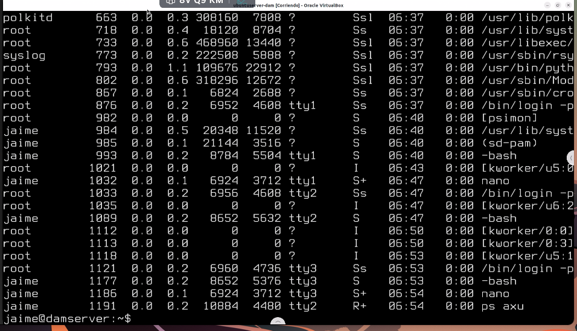
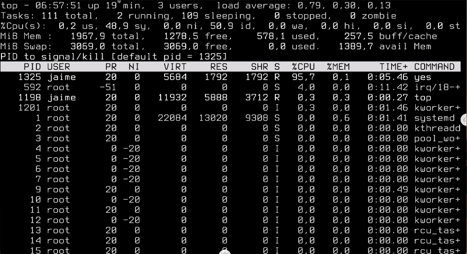
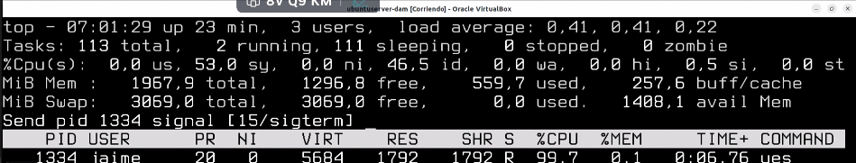
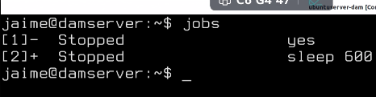
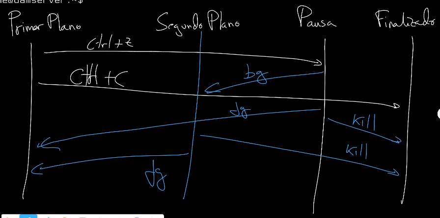

# 🐧☁️ Linux Server (Ubuntu server)

## 🎛️ Configuración de las tarjetas de red

La configuración de las tarjetas de red se almacena bajo el lenguaje de marcado para configuración YAML habitualmente en la ruta:

`sudo nano /etc/netplan/50-cloud-init.yaml`

Este sería un ejemplo de configuración para dos tarjetas de red:
```yaml
network:
  version: 2
  ethernets:

    # Primera tarjeta de red
    enp0s3:
      dhcp4: no # Desactivo el DHCP por IPv4

      # Por lo tanto asigno IP estatica y net mask
      addresses: [192.168.213.200/20]

      # Asigno DNS
      nameservers:
        addresses: [1.1.1.1, 8.8.8.8]
      
      # Puerta de enlace/dirección del router
      routes:
        - to: default
          via: 192.168.213.1
    
    # Segunda tarjeta de red
    enp0s8:
      dhcp4: true # Esta va por DHCP 
```

Para que la configuración entre en acción:

```bash
# Prueba la configuración y la revierte tras unos segundos por si no va bien
netplan try

# Hace persistente la configuración
netplan apply
```
## 📝 Controlar procesos y tareas (monitorización)

### ⚙️ Procesos


Para ver la lista de procesos utilizamos el comando `$ ps`

La salida es así:


El problema es que la lista no está ordenada ni en tiempo real por lo que no podemos saber cual es el proceso más pesado.

Para esto existe el comando `$ top`


Desde top para matar un proceso pulsamos la letra `K` y se nos pregunta si deseamos matar por defecto el que mas cpu usa, pero podemos escribir el PID de cualquier proceso, después nos pregunta que señal mandarle (15 porfavo muerete, 9 meterle un tiro)



Hay distintas versiones de `top` como `htop` y eso con mas colorines.

#### 🚀 Comandos interesantes 
- `$ yes` : Imprime tol rato `y` usando toda la cpu
- `$ kill -9 PID` : Matar a la fuerza
- `$ killall nombreprograma` : mata todas las instancias de un programa

### 📋 Tareas

Para ver la lista de tareas `$ jobs` lo que saca:



Cada tarea tiene un numero asignado al cual podremos referirnos despues para algunas operaciones.

#### **🚀 Las operaciones con tareas mas interesantes son:**
- Pasar a segundo plano una tarea `$ bg num`
- Traer a primer plano (o reanudarlo si estaba stopped) `$ fg num`
- Detener una tarea 'ctrl + Z'
- Reanudarla con `$ fg num` o `$ bg num`
- Arrancar en segundo plano directamente: `$ COMANDO &`
- Matar el proceso de una tarea: `$ kill %ID`

Si una tarea está en segundo plano puede no dejar escribir en la terminal, en ese caso deberíamos cambiar de terminal y [matar](#-comandos-interesantes) el proceso.


Para mover las tareas sirve de esquema de lo anterior la siguiente imagen:


## 💭 Memoria RAM

Podemos monitorizar directamente la memoria con el comando `free`.

## 🛟 Software de monitorización util

- ps
- top: Monitor de recursos en RT por defecto.
- htop: Monitor de recursos en RT mubonito.
- nmon: Monitor de recursos en RT modular.
- dstat: Monitor de recursos en tiempo real.
- iptraf-ng: Analizador de red tipo wireshark.
