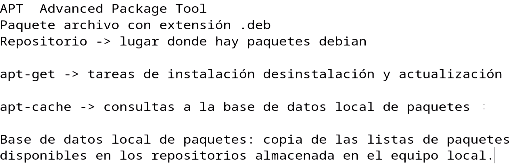
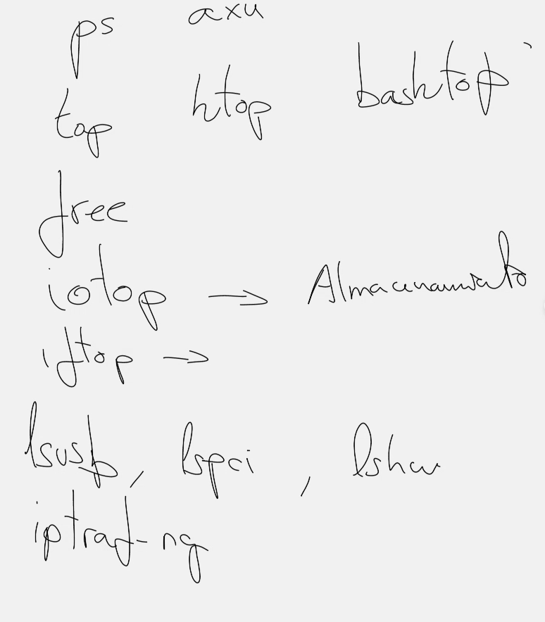

# UD8: Usuarios y grupos en linux

## 👤 Administración de usuarios

### 🐧Unix based OS's

- **🆕 Crear usuario**: `sudo useradd [opciones] nombre-usuario`  
  - `-g`: Grupo principal  
  - `-d`: Carpeta home  
  - `-m`: Crear carpeta home  
  - `-s`: Shell del usuario  
  - *Ejemplo*: `sudo useradd -g profesores -d /home/pedro -m -s /bin/bash pedro`  

- **🔏 Establecer contraseña**: `sudo passwd nombre-usuario`  
- **📝 Modificar usuario**: `sudo usermod [opciones] nombre-usuario`  
  - *Ejemplo*: `sudo usermod -d /home/carpeta_pedro pedro`  
- **🗑️ Eliminar usuario**: `sudo userdel nombre-usuario`
  - **Eliminando dir personal**`sudo userdel -r nombre-usuario`
- **📝 Cambiar propietario de un archivo**: `chown `

### 🌀Debian based distros

- **🆕 Crear usuario**: `sudo adduser nombre-usuario` 
- **🗑️ Eliminar usuario**: `sudo deluser nombre-usuario`
  - **Eliminando dir personal**`sudo deluser --remove-home nombre-usuario`

## 👥 Administración de grupos

### 🐧Unix based OS's

- **🆕 Crear grupo**: `sudo groupadd nombre-grupo`  
  - *Ejemplo*: `sudo groupadd alumnos`  

- **📝 Modificar grupo**: `sudo groupmod [opciones] nombre-grupo`  
  - *Ejemplo*: `sudo groupmod -g 2000 profesores`  
- **🗑️ Eliminar grupo**: `sudo groupdel nombre-grupo`  
- **👤➡️👥 Añadir usuario a grupo**: `sudo gpasswd -a usuario grupo`  
  - *Ejemplo*: `sudo gpasswd -a juan profesores`  
- **👤➡️❌Quitar usuario de grupo**: `sudo gpasswd -d usuario grupo`  
  - *Ejemplo*: `sudo gpasswd -d juan profesores`
- **📝 Cambiar grupo de un archivo**: `chgrp `  

### 🌀Debian based distros

- **🆕 Crear grupo**: `sudo addgroup nombre-grupo`  
  - *Ejemplo*: `sudo addgroup alumnos`

- **🗑️ Eliminar grupo**: `sudo delgroup nombre-grupo`
- **👤➡️👥 Añadir usuario a grupo**: `sudo adduser usuario grupo`  
  - *Ejemplo*: `sudo adduser juan profesores`
- **👤➡️❌ Quitar usuario de grupo**: `sudo deluser usuario grupo`  
  - *Ejemplo*: `sudo deluser juan profesores`  

<br>
<br>
📖 Para más info: `man nombre-del-comando` 💡


## 🚷 Permisos

### 👀 Ver/Comprobar permisos
Cuando hacemos `ls -l` vemos los permisos:
```bash
drwx------@  13 gsu  staff   416  3 abr 10:48 Desktop
```
Son 9 huecos que se manejan de tres en tres:

Las opciones para cada hueco son:

- Lectura `r` (Read)
- Escritura `w` (Write)
- Ejecución `x` (eXecution)

### 🎛️ Asignar/Cambiar permisos (se debe ser root)


> ⚠️ ATENCIÓN <br>
>
> Se deben ejecutar desde el usuario `root` todos aquellos comandos de asignación de permisos que involucran a distintos usuarios

La mascara, como se ve en la imagen se crea en binario y despues cada grupo se pasa a decimal, es decir, pasamos cada grupo de 3 bits a un numero entre 0 (ningun permiso) y 7 (todos los permisos).


Para asignar o cambiar los permisos se usa `chmod (mascara) ruta/a/afectar`
```bash
                           # |user  | |group | |other|
$ chmod 775 ruta/a/afectar # |rwx(7)| |rwx(7)| |rx(5)|
$ chmod 554 ruta/a/afectar # |rx(5) | |rx(5) | |r(4) |
```
---
Existe una notación simbólica la cual sirve para asignar de forma mas rapida de forma separada `([-u]ser)`, grupo `([-g]roup)` u otros `([-o]ther)`:


```bash
$ chmod o-rwx ruta/a/afectar
$ chmod g-rwx ruta/a/afectar
```

## 📦 Paquetes

### 🎁 Gestores de paquetes

Utilizan paquetes disponibles en repositorios públicos o privados para instalar las aplicaciones.

En debian se utiliza el gestor de paquetes **apt**:



#### **Los comandos mas usados**:
- `$ apt update`
- `$ apt upgrade`: Actualiza los paquetes instalados a sus versiones más recientes.  
- `$ apt install nombre-paquete`: Instala un paquete específico.  
- `$ apt remove nombre-paquete`: Elimina un paquete instalado.  
- `$ apt autoremove`: Elimina paquetes instalados automáticamente que ya no son necesarios.  
- `$ apt search nombre-paquete`: Busca un paquete en los repositorios.  
- `$ apt show nombre-paquete`: Muestra información detallada de un paquete.  
- `$ apt list --installed`: Lista todos los paquetes instalados en el sistema.  
- `$ apt clean`: Limpia los archivos de caché descargados por `apt`.  
- `$ apt purge nombre-paquete`: Elimina un paquete y sus archivos de configuración.
- `$ apt dist upgrade`: Para actualizar la distribución a una version mayor (peligroso)

### ☁️ Repositorios

Lugares web donde se pueden conseguir paquetes.

La lista de repositorios que tiene nuestro sistema disponible está en:

```bash
$ nano /etc/apt/sources.list
```

Y tiene esta pinta:


Tras el enlace tenemos los siguientes modificadores:

- bookworm: Nombre del sistema
- main: Rama del repositorio a la que se desea acceder
- contrib: 
- non-free: Permite descargar software no libre
- non-free-firmware: Permite descargar firmware no libre

# UD8: Operaciones de red  en Linux

> 🚀 Recuerda <br>
> Para tener conexion a internet necesitamos:
>- Direccion IP valida para la interfaz (manual/DHCP)
>- Configurar la puerta de enlace (Gateway) (ruta predeterminada).
>- Definir servidores DNS (ej: 8.8.8.8, 1.1.1.1).

## 📟 Interfaces de red

Podemos controlarlas mediante el comando `ip`:

- **Encender**: `$ ip link set enp0s1 up`
- **Apagar**: `$ ip link set enp0s1 up`

Para ver las direcciones ip asignadas a las interfaces de red:

```bash
$ ip [a]dress
```


Para asignar IPs manualmente:

- A una interfaz de red:
`$ ip a add 192.168.X.X/24 dev [nombre_de_la_interfaz]`
- Para la puerta de enlace:
`$ ip route add default via [IP-de-la-puerta-de-enlace] dev [interfaz]`
- Desasignar una ip a una interfaz de red:
`$ ip a del [IP/Máscara] dev [interfaz]`
- Desasignar la ip a la puerta de enlace:
`$ ip route del [red/máscara] via [IP-del-gateway] dev [interfaz]`
- Asignar DNS temporal:
`$ nano /etc/resolv.conf`

# UD8: Usuarios y grupos en Windows (Cae en el examen comparar esto entre windows y linux)

## Administrador de Equipos

Con esta herramienta puedo administrar los usuarios y grupos en windows.

En windows se pueden añadir tantos usuarios y grupos como se quiera pero existen mas opciones a la hora de asignar permisos.

Existe la opción permitir y la opción denegar la cual prevalece por lo que si a un archivo tiene acceso total un grupo pero a un usuario del grupo se le deniegan permisos, no tendrá acceso aunque pertenezca a un grupo con acceso.

Comparativa de permisos Linux vs. Windows (resumen):

**Comparativa de permisos Linux vs. Windows (resumen):**  

- **Linux**:  
  - **3 permisos básicos**: Lectura (`r`), Escritura (`w`), Ejecución (`x`).  
  - **3 roles**: Dueño, Grupo y Otros.  
  - **Representación**: Notación simbólica (ej. `rwxr-xr--`) o octal (ej. `755`).  
  - **Comandos**: `chmod`, `chown`, `chgrp`.  
  - **Permisos especiales**: SUID, SGID, Sticky Bit.  

- **Windows**:  
  - **ACL (Listas de Control de Acceso)**: Permisos granulares (Leer, Modificar, Control total, etc.).  
  - **Asignación**: A usuarios/grupos específicos.  
  - **Herencia**: Los subdirectorios/archivos pueden heredar permisos.  
  - **Gestión**: Interfaz gráfica (Propiedades > Seguridad) o comandos (`icacls`).  

**Diferencia clave**:  
- Linux usa permisos simples y fijos (salvo ACLs avanzadas).  
- Windows usa ACLs flexibles con herencia y gestión visual.  

(✔️ Perfecto para media cara de folio).

# Examen

- Usuarios y grupos (1 punto)
  - Carpeta /etc:
    - passwd: Cuentas
      ```
      Comandos interesantes para cuentas:

      - passwd pepe: Cambiar contraseña
      - passwd -l pepe: Bloquear la cuenta
      - passwd -u pepe: Desbloquear la cuenta
      - chown: Cambiar usuario propietario
      ```
    - shadow: Contraseñas *cifradas*
    - groups - Grupos (Interesante -> grupo sudo )

- Repositorios y gestores de paquetes ()
  - Repositorios:
    - Lugar donde se guardan paquetes de instalación
    - Puede ser local u online
  - Gestores de paquetes:
    - apt
  - Codigo fuente:
    - leer el INSTALL
    - ejecutar el ./configure para ver si está todo ok antes de instalar
    - make para compilar
    - sudo make install para instalar para todo el equipo

- Monitorización:
  - Software necesario
  
  - Hardware:
    - lsusb, lspci, lshw
